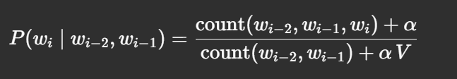

# N-gram Probability Visualizer GUI

A lightweight, multilingual desktop application to compute and visualize unigram, bigram and trigram probabilities on your own counts, with step-by-step formulas and results in Portuguese, English and French.

---

## 🔍 What’s This Project?

This friendly Tkinter GUI lets you:

* **Load or paste** your unigram, bigram or trigram counts (one n-gram + count per line).
* **Select** which order to use (1-gram, 2-gram, 3-gram) and whether to apply **Laplace smoothing**.
* **Enter a sentence** (with `<s>`/`</s>` markers if you like).
* **Compute** each conditional probability $P(w_i \mid w_{i-n+1}\dots w_{i-1})$ with full formulas:

  * Shows numerator, denominator, numerical substitution and resulting value.
  * Accumulates log-probabilities and reports the final probability.
* **Switch languages** (🇵🇹 PT, 🇬🇧 EN, 🇫🇷 FR) and see all labels update live—no need to recalculate.
* **Edit counts on the fly** or load a `counts.json` to override defaults.

---

## 📚 Why N-grams?

N-gram models are a foundational technique in NLP and information retrieval:

1. **Unigrams** estimate $P(w)$ by frequency of single words.
2. **Bigrams/Trigrams** capture local context:

   
3. **Laplace smoothing** ($\alpha=1$) avoids zero probabilities for unseen n-grams.
4. Step-by-step breakdown helps you understand exactly how the model computes each factor.

---

## 📝 Example Workflow

1. **Default counts** are already loaded (you can edit them).

   ```txt
   <s> 5
   não 2
   batatas 2
   ...
   como não 1
   não podes comer 1
   ...
   ```
2. **Select “3”** (trigrams), optionally check **“Laplace smoothing”**.
3. **Type** your sentence, e.g.:

   ```
   não podes comer batatas fritas
   ```
4. **Click Calculate** →
   🔹 Left pane shows each conditional probability line-by-line
   🔹 Final log-prob and probability displayed at bottom
   🔹 Change to EN or FR instantly updates all labels

---

## 🚀 Installation & Usage

```bash
git clone https://github.com/yourusername/ngram-probability-visualizer.git
cd ngram-probability-visualizer

# (Optional) create & activate venv
python3 -m venv venv
source venv/bin/activate    # macOS/Linux
venv\Scripts\activate       # Windows

python ngram_gui.py
```

If you place a **counts.json** alongside `ngrams_1.py`, it will override the built-in defaults. Format:

```jsonc
{
  "1": { "<s>": 5, "não": 2, /* … */ },
  "2": { "<s> não": 1, "não podes": 1, /* … */ },
  "3": { "<s> não podes": 1, /* … */ }
}
```

---

## 📄 License

MIT © 2025

Feel free to use, fork, and contribute!
